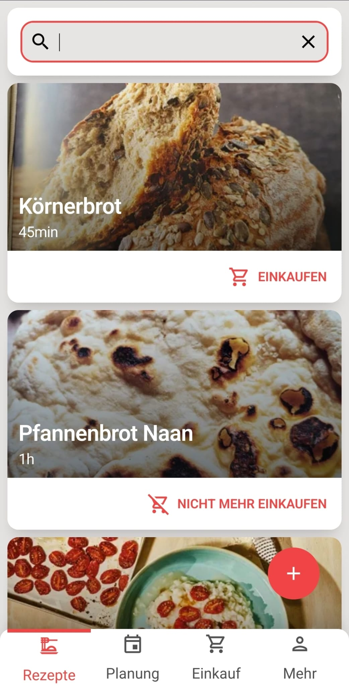
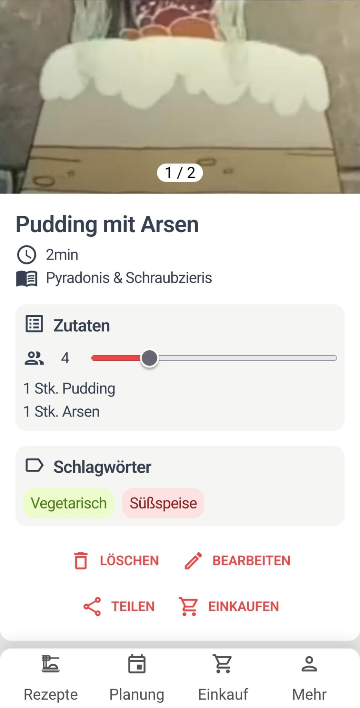
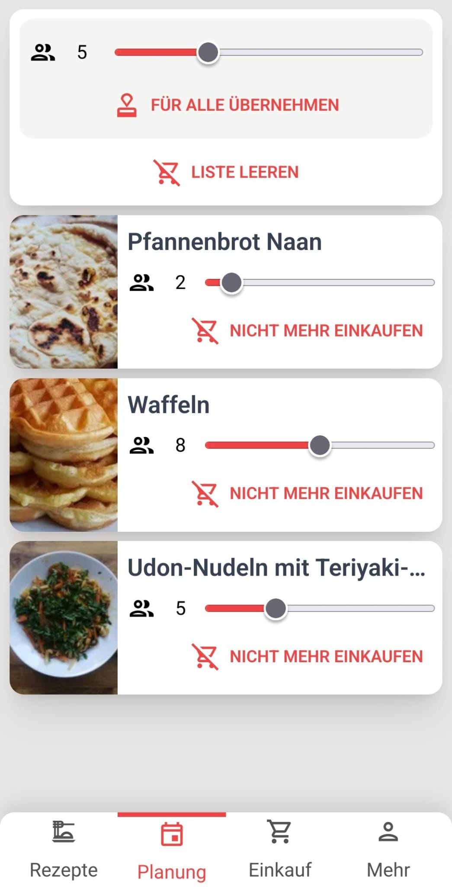
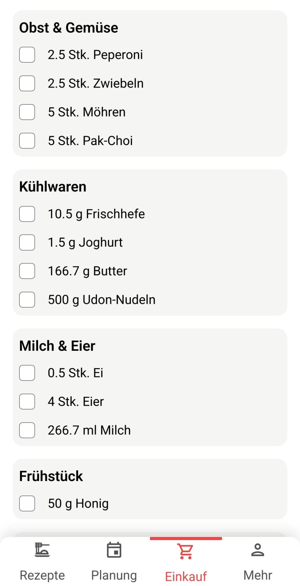

# Mahlzeit Frontend

The idea of this Persistent Web App (PWA) based on Vue is to simplify grocery shopping. The user can add recipes with a list of ingredients. The recipes can then be selected as planned meals for the next week. The app then constructs a shopping list in which the ingredients of all planned meals are grouped by super market section.

Used technology:
* Vue 3
* Typescript
* Tailwind
* WPA